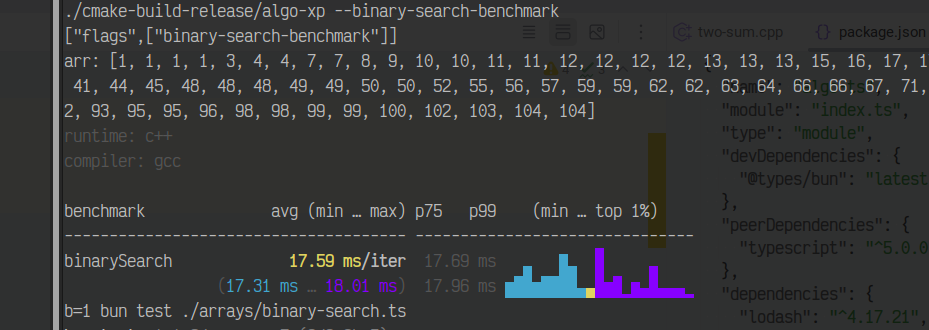
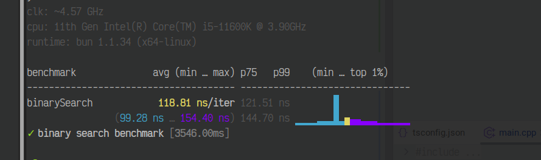
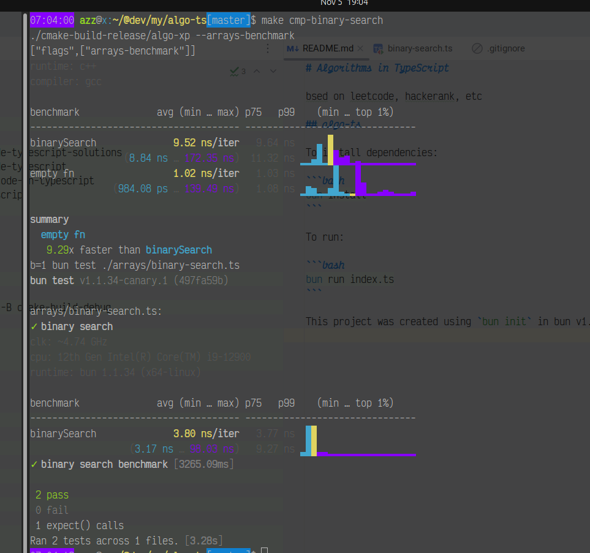

# Algorithms in `typescript` vs `c++`

<!-- TOC -->
* [Algorithms in TypeScript](#algorithms-in-typescript)
  * [algo-ts](#algo-ts)
  * [Benchmarks](#benchmarks)
    * [Bun vs GCC Compiled `cpp` :joy:](#bun-vs-gcc-compiled-cpp-joy-)
<!-- TOC -->

Based on leetcode, hackerank, etc

## About

This project was created using `bun init` in bun v1.1.34. [Bun](https://bun.sh) is a fast all-in-one JavaScript runtime.
To install dependencies:

```bash
curl -fsSL https://bun.sh/install | bash
```


```bash
bun install
```

To run:

```bash
bun run index.ts
```


## Algos
- Arrays and Hashing
- Two Pointers
- Sliding Window
- Binary Search
- Linked Lists
- Trees
- Heap (Priority Q)
- Graphs

## Benchmarks

### Binary Search
#### Bun vs GCC Compiled `c++` for array length=1_000_000 si:joy: 


for sorted array using bun 



---

